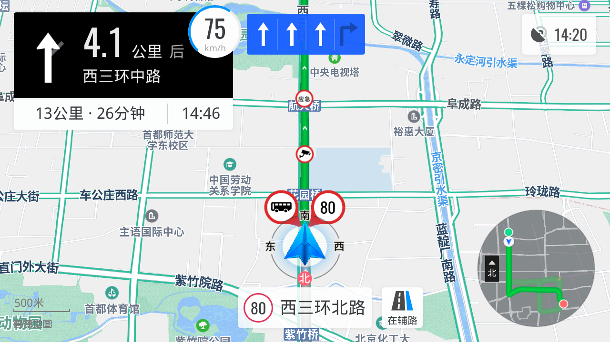
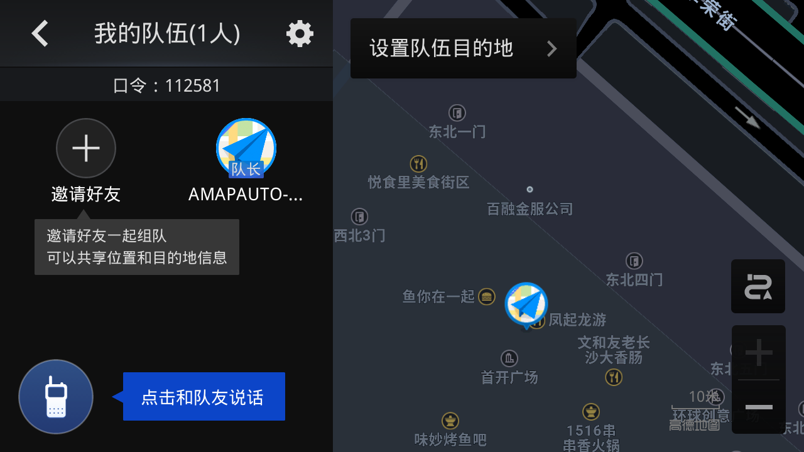
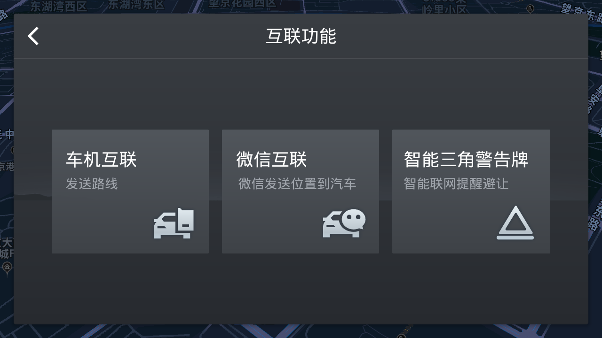
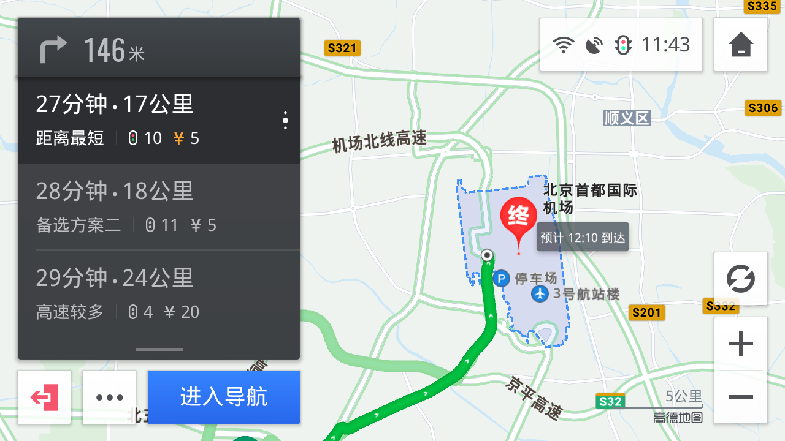
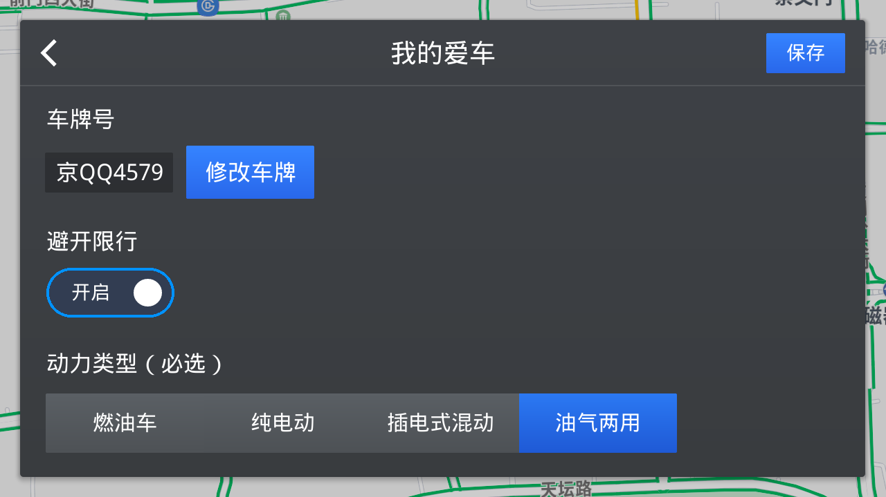

    <code></code>
      
    <code></code>
    <code></code>
    <code></code>
      
    <code></code>  
    <code></code>
    <code></code>
    <code></code>
      
    <code></code>
    <code></code>
    <code></code>
    <code></code>
    <code></code>
      
    <code></code>

## 高德地图 - APP
#### 版本：V6.1.0
> AUTO V6.1.0 正式版 2022-04-28 全新发布, 欢迎各位高铁使用
1. 大小：72.48 MB
2. 时间：2022-03-17 测试版 发布
3. 介绍：AUTO V6.1.0 测试版 2022-03-17 全新发布, 欢迎各位高铁使用
4. 官网：[高德地图车机版][autoAmap]
5. 亮点详解：
   1. 首页升级更懂你，一键出发更高效
      + 回家、去洗车、去搜过的地方......小德想你所想，首页快速出发
      + 
   2. 路线标签上新啦，选择从此更简单
      + 新增车间距抓拍、限行、违规用灯等电子眼，种类更丰富，播报更贴心
      + 
6. 更新日志：
   - 2022-05-20
      1. 静音设置无法保存问题修复
   - 2022-04-21
      1. 途经点预计到达时间展示错误问题修复
      2. 备选路线刷新提示问题修复
      3. 开机自启动桌面组件透明问题修复
      4. 比例尺控件崩溃问题修复
      5. 手车互联问题修复
      6. 行程记录同步异常问题修复
   - 2022-04-14
      1. 部分场景崩溃问题修复
      2. 备选路线展示错误问题修复
      3. 其他问题修复
   - 2022-03-31
      1. 修复了路口大图路牌无字问题
      2. 修复了行中场景备选路线标签问题
   - 2022-03-17
      1. 首页焕新，外观全面升级
      2. 路线标签更新，选择更简单
7. APP下载地址
   * 车 机 版
      + 2022-05-20 正式版
         + [V6.1.0.600644](https://mapdownload.autonavi.com/apps/auto/manual/V610/AUTO_V6.1.0.600644_release_signed.apk)
      + 2022-04-28 正式版
         + [V6.1.0.600437](https://mapdownload.autonavi.com/apps/auto/manual/V610/Auto_V6.1.0.600437_release_signed.apk)
      + 2022-04-21 众测版
         + [V6.1.0.600317](https://mapdownload.autonavi.com/apps/auto/manual/V610/Auto_V6.1.0.600317_release_signed.apk)
      + 2022-04-14 众测版
         + [V6.1.0.600251](https://mapdownload.autonavi.com/apps/auto/manual/V610/Auto_V6.1.0.600251_release_signed.apk)
      + 2022-03-31 测试版
         + [V6.1.0.600180](https://mapdownload.autonavi.com/apps/auto/manual/V610/Auto_6.1.0.600180_beta.apk)
      + 2022-03-17 内测版
         + [V6.1.0.600014](https://mapdownload.autonavi.com/apps/auto/manual/V610/AUTO_6.1.0.600014_beta.apk)
   * 车 镜 版

#### 版本：V6.0.0
> AUTO V6.0.0 内测版 2021-12-24 全新发布, 欢迎各位高铁使用
1. 大小：70.5 MB
2. 时间：2022-01-06 测试版 发布
3. 介绍：AUTO V6.0.0 内测版 2021-12-24 全新发布, 欢迎各位高铁使用
4. 官网：[高德地图车机版][autoAmap]
5. 亮点详解：
   1. 路口大图效果升级
      + 新增路牌、收费站、红绿灯指引，大图效果更还原
      + 
   2. 优化电子眼种类与播报
      + 新增车间距抓拍、限行、违规用灯等电子眼，种类更丰富，播报更贴心
      + 
6. 更新日志：
   - 2022-01-19
      1. 手车互联场景，不显示电子眼和路口大图问题
      2. 车标显示过小问题
      3. 车头方向朝向错误问题
      4. 手车互联，不自动发起导航问题
      5. 悬浮球压盖问题
      6. 崩溃卡死等问题
   - 2022-01-12
      1. 修复车道线显示异常、软件崩溃等问题
   - 2022-01-06
      1. 修复路口大图无箭头问题
      2. 优化夜间图面太黑问题
      3. 修复已知崩溃问题
   - 2021-12-24
      1. 路口大图效果升级
      2. 优化电子眼种类与播报
7. APP下载地址
   * 车 机 版
      + 2022-02-19 正式版 (已弃用)
         + [V6.0.0.600619](https://mapdownload.autonavi.com/apps/auto/manual/V600/Auto_V6.0.0.600619_release.apk)
      + 2022-01-19 正式版
         + [V6.0.0.600475](https://mapdownload.autonavi.com/apps/auto/manual/V600/Auto_V6.0.0.600475_release.apk)
      + 2022-01-12 测试版
         + [V6.0.0.600444](https://mapdownload.autonavi.com/apps/auto/manual/V600/Auto_V6.0.0.600444_release_signed.apk)
      + 2022-01-06 测试版
         + [V6.0.0.600420](https://mapdownload.autonavi.com/apps/auto/manual/V600/Auto_V6.0.0.600420_release_signed.apk)
      + 2021-12-24 内测版
         + [V6.0.0.600308](https://mapdownload.autonavi.com/apps/auto/manual/V600/Auto_6.0.0.600308_beta.apk)
   * 车 镜 版

#### 版本：V5.6.0
> AUTO V5.6.0 公测版 2021-11-04 全新发布, 欢迎各位高铁使用
1. 大小：69.7 MB
2. 时间：2021-11-18 正式版发布
3. 介绍：AUTO V5.6.0 公测版 2021-11-04 全新发布, 欢迎各位高铁使用
4. 官网：[高德地图车机版][autoAmap]
5. 亮点详解：
   1. 拥堵聊天室全新上线
      + 为什么拥堵？多久能通畅？看看车友怎么说
      + 
   2. 优化路线拥堵信息
      + 拥堵情况早知道，提前规划更高效
      + 
6. 更新日志：
   - 2021-11-04
      1. 拥堵聊天室全新上线
      2. 优化路线拥堵信息
7. APP下载地址
   * 车 机 版
      + 2021-11-23
         + [V5.6.0.600244](https://mapdownload.autonavi.com/apps/auto/manual/V560/Auto_5.6.0.600244_release.apk)
      + 2021-11-18
         + [V5.6.0.600185](https://mapdownload.autonavi.com/apps/auto/manual/V560/Auto_5.6.0.600185_release.apk)
      + 2021-11-11
         + [V5.6.0.600137](https://mapdownload.autonavi.com/apps/auto/manual/V560/Auto_5.6.0.600137_beta.apk)
      + 2021-11-04
         + [V5.6.0.600108](https://mapdownload.autonavi.com/apps/auto/manual/V560/Auto_5.6.0.600108_beta.apk)
   * 车 镜 版
      + 2021-12-10
         + [V5.6.0.600021](https://mapdownload.autonavi.com/apps/auto/manual/mirror/Auto_5.6.0.600021_AutoLite_GuanWang_signed.apk)

#### 版本：V5.5.0
> AUTO V5.5.0 众测版2021-09-01发布，欢迎各位高铁使用~
1. 大小：68.8 MB
2. 时间：2021-10-13 正式版发布
3. 介绍：2021-09-01 公测版发布
4. 官网：[高德地图车机版][autoAmap]
5. 亮点详解：
   1. 搜索体验升级
      + 子点信息更详尽，个性化标签更懂你
      + 
   2. 路口大图渲染样式升级
      + 更真实的路口样式，更直观的引导体验
      + 
   3. 路线动态信息通知
      + 途径疫情城市？目的地景区临时关门？高德统统告诉你
      + 
   4. 高德专享加油优惠
      + 在线下单更方便，加油价格更便宜
      + 
6. 更新日志：
   - 2021-09-15
      1. 高德专享加油优惠
   - 2021-09-01
      1. 搜索体验升级
      2. 路口大图渲染样式升级
      3. 路线动态信息通知
7. APP下载地址
   * 车 机 版
      + 2021-10-13
         + [V5.5.0.600391](https://mapdownload.autonavi.com/apps/auto/manual/V550/Auto_V5.5.0.600391_release_signed.apk)
      + 2021-09-24
         + [V5.5.0.600329](https://mapdownload.autonavi.com/apps/auto/manual/V550/Auto_5.5.0.600329_beta.apk)
      + 2021-09-15
         + [V5.5.0.600246](https://mapdownload.autonavi.com/apps/auto/manual/V550/Auto_5.5.0.600246_beta.apk)
      + 2021-09-01
         + [V5.5.0.600109](http://mapdownload.autonavi.com/apps/auto/manual/V550/Auto_5.5.0.600109_beta.apk)
   * 车 镜 版

#### 版本：V5.3.0
> AUTO V5.3.0 众测版2021-07-06发布，欢迎各位高铁使用~
1. 大小：66.3 MB
2. 时间：2021-07-23 正式版
3. 介绍：2021-07-06 众测版发布
4. 官网：[高德地图车机版][autoAmap]
5. 亮点详解：
   1. 新增巡航路况概览模式
      + 巡航路况一键概览，周边交通尽在掌控
      + 
   2. 新增扩展车道
      + 车道变化早知道，提前变道更从容
      + 
   3. 高速出口强化
      + 出口动作强化提醒，信息高效不偏航
      + 
   4. 区间测速升级
      + 区间测速一目了然，限速提醒不容错过
6. 更新日志：
   - 2021-07-23 正式版
      1. 新增巡航路况概览模式
      2. 新增扩展车道
      3. 高速出口强化
      4. 区间测速升级
   - 2021-07-09
      1. 解决部分bug和崩溃问题，提升版本稳定性
   - 2021-07-06
      1. 新增巡航路况概览模式
      2. 新增扩展车道
      3. 高速出口强化
      4. 区间测速升级
7. APP下载地址
   * 车 机 版
      + 2021-07-23
         + [V5.3.0.600050](https://mapdownload.autonavi.com/apps/auto/manual/V530/Auto_V5.3.0.600050_release_signed.apk)
      + 2021-07-15
         + [V5.3.0.600040](https://mapdownload.autonavi.com/apps/auto/manual/V530/Auto_5.3.0.600040_beta_signed.apk)
      + 2021-07-09
         + [V5.3.0.600019](https://mapdownload.autonavi.com/apps/auto/manual/V530/Auto_5.3.0.600019_beta_signed.apk)
      + 2021-07-06
         + [V5.3.0.600012](https://mapdownload.autonavi.com/apps/auto/manual/V530/Auto_5.3.0.600012_beta_signed.apk)
   * 车 镜 版

#### 版本：V5.2.0
> AUTO V5.2.0 众测版2021-05-06发布，欢迎各位高铁使用~
1. 大小：65.3 MB
2. 时间：2021-06-23 正式版发布
3. 介绍：2021-05-06 众测版发布
4. 官网：[高德地图车机版][autoAmap]
5. 亮点详解：
   1. 巡航效果优化
      + 图面渲染效果 、楼块、道路名展示优化，显示更清晰
   2. 电子眼信息更丰富
      + 近期新增电子眼提示，告别违章
   3. 建议车道提醒
      + 导航中显示推荐车道，引导更准确
   4. 精细化路况表达
      + 新增深绿路况表达极度畅通 ，辅助路线决策
6. 更新日志：
   - 2021-05-06
      1. 巡航效果优化
      2. 电子眼信息更丰富
      3. 建议车道提醒
      4. 精细化路况表达
7. APP下载地址
   * 车 机 版
      + 2021-06-23
         + [V5.2.0.600326](https://mapdownload.autonavi.com/apps/auto/manual/V520/Auto_V5.2.0.600326_release_signed.apk)
      + 2021-06-10
         + [V5.2.0.600198](https://mapdownload.autonavi.com/apps/auto/manual/V520/Auto_V5.2.0.600198_beta_signed.apk)
      + 2021-06-10
         + [V5.2.0.600194](https://mapdownload.autonavi.com/apps/auto/manual/V520/Auto_V5.2.0.600194_beta_signed.apk)
      + 2021-06-04
         + [V5.2.0.600181](https://mapdownload.autonavi.com/apps/auto/manual/V520/Auto_5.2.0.600181_beta_signed.apk)
      + 2021-05-20
         + [V5.2.0.600156](https://mapdownload.autonavi.com/apps/auto/manual/V520/Auto_5.2.0.600156_beta_signed.apk)
      + 2021-05-06
         + [V5.2.0.600024](https://mapdownload.autonavi.com/apps/auto/manual/V520/Auto_5.2.0.600024_beta.apk)
   * 车 镜 版

#### 版本：V5.1.0
> 敬告：此版本未与车辆原厂设备适配，请酌情安装试用
1. 大小：61.7MB
2. 时间：2021-04-07 正式版
3. 介绍：2021-03-11 测试版发布
4. 官网：[高德地图车机版][autoAmap]
5. 亮点详解：
   1. 导航语音全新升级
      1. 新增小团团、元气女声等导航语音包
      2. 发音效果全面升级，好听又清晰
   2. 电子眼信息更丰富
      1. 新增压线、拨打电话、礼让行人等电子眼类型
      2. 新增近期多人被拍提示，告别违章
   3. 定位问题一键诊断
      1. 无法定位时，快速诊断问题原因
      2. 包括定位权限、卫星信号、定位模块等检测判断
   4. 屏幕显示校正
      1. 解决屏幕偏色导致的显示过亮、过暗问题
6. 更新日志：
   - 2021-03-11
      1. 导航语音全新升级
      2. 电子眼信息更丰富
      3. 定位问题一键诊断
      4. 屏幕显示校正优化
7. APP下载地址
   * 车 机 版
      + 2021-04-07 正式版
         + [V5.1.0.600153](https://mapdownload.autonavi.com/apps/auto/manual/V510/guanwangV5.1.0.600153_1126WWFGE2.apk)
      + 2021-04-06
         + [V5.1.0.600151](https://mapdownload.autonavi.com/apps/auto/manual/V510/Auto_V5.1.0.600151_release_signed.apk)
      + 2021-03-22
         + [V5.1.0.600083](https://mapdownload.autonavi.com/apps/auto/manual/V510/Auto_5.1.0.600083_android_armeabi_v7a_signed.apk)
      + 2021-03-15
         + [V5.1.0.600079](https://mapdownload.autonavi.com/apps/auto/manual/V510/guanwangV5.1.0.600079_0322WWFGE2.apk)
      + 2021-03-11
         + [V5.1.0.600034](https://mapdownload.autonavi.com/amapauto/apk/autobasic/guanwangV5.1.0.600034_0311WEFRG3.apk)
   * 车 镜 版

#### 版本：V5.0.0
> 敬告：此版本为暂未与车辆原厂设备适配，可能存在未知缺陷或异常，因此请酌情安装试用！
1. 大小：56.6MB
2. 时间：2021-01-28 正式版
3. 介绍：2020-12-22 测试发布
4. 官网：[高德地图车机版][autoAmap]
5. 亮点详解：
   1. 导航信息升级
      1. 电子眼显示剩余距离，一眼看到电子眼离你多远
      2. 拥堵气泡详情扩展，提前了解拥堵原因与影响车道
      3. 
   2. 路线情况更详细，差路小路早知道
      1. 提前告知该路线可能存在的“坑”，例如“货车多”、“有小路”、“拥堵多”，帮助您选择更合适的路线
      2. 
   3. 新增动态路口大图
      1. 在复杂路口增加动态引导，让复杂路口一目了然
6. 更新日志：
   - 2021-02-05
      1. 导航信息升级
      2. 路线详情拓展
      3. 修复备选路标签不显示问题
   - 2021-01-04
      1. 路口大图问题
      2. 崩溃闪退问题
      3. 车速悬浮球设置不生效问题
      4. 日间界面效果优化
   - 2020-12-22
      1. 导航信息：电子眼信息更丰富，拥堵信息更全面
      2. 路线详情：路线情况更详细，差路小路早知道
      3. 路口指引：新增动态路口大图，复杂路口一目了然
7. APP下载地址
   * 车 机 版
      + 2021-02-05 正式版
         + [V5.0.0.600066](https://mapdownload.autonavi.com/apps/auto/manual/V500/guanwangV5.0.0.600066_0205WWFFG2.apk)
      + 2021-01-28 正式版
         + [V5.0.0.600062](https://mapdownload.autonavi.com/apps/auto/manual/V500/guanwangV5.0.0.600062_0128WWFFG2.apk)
      + 2021-01-20
         + [V5.0.0.600042](http://mapdownload.autonavi.com/apps/auto/manual/V500/guanwangV5.0.0.600042_0121WWFFG2.apk)
      + 2021-01-15
         + [V5.0.0.600022](https://mapdownload.autonavi.com/apps/auto/manual/V500/guanwangV5.0.0.600022_0113WWFFG2.apk)
      + 2021-01-04
         + [V5.0.0.600011](https://mapdownload.autonavi.com/apps/auto/manual/V500/Auto_5.0.0.600011_beta_signed.apk)
      + 2020-12-22
         + [V5.0.0.600004](https://mapdownload.autonavi.com/amapauto/apk/autobasic/guanwangV5.0.0.600004_3216WWREE2.apk)
   * 车 镜 版
      + 2021-03-01 正式版
         + [V5.0.5.600132](https://mapdownload.autonavi.com/apps/auto/manual/mirror/Auto_5.0.5.600132_AutoLite_GuanWang_signed.apk)

#### 版本：V4.9.0
> 敬告：此版本为暂未与车辆原厂设备适配，可能存在未知缺陷或异常，因此请酌情安装试用！
1. 大小：62.4MB
2. 时间：2020-11-26 正式版
3. 介绍：11月12日测试发布
4. 官网：[高德地图车机版][autoAmap]
5. 亮点详解：
   1. 手车互联：遥控功能升级
      1. 手机秒变遥控器，支持更多遥控车机功能，包括更改目的地、沿途搜、更改偏好等
      2. 持续提升连接准确率
      3. 
   2. 巡航拥堵早知道
      1. 增加前方路段拥堵信息提示；支持展示拥堵时长、拥堵距离等
      2. 
   3. 组队对讲：告别对讲机，沿途畅快聊
      1. 增加对话流列表的展示
      2. 增加支持其他消息类型的接收：组队消息、文本消息等
      3. 
   4. 货车导航上线，智能避开限行
      1. 全面支持货车导航功能；支持货车资料填写和编辑、包括车牌、车高、车重等
      2. 支持提示货车限行范围、智能避开货车限行路段
      3. 
6. 更新日志：
   - 2020-11-12
      1. 手车互联：手机秒变遥控器
      2. 巡航场景：拥堵早知道
      3. 组队对讲：告别对讲机、沿途畅快聊
      4. 货车导航：正式上线，智能避开货车限行
7. APP下载地址
   * 车 机 版
      + 2020-11-26 正式版
         + [V4.9.0.600173](https://mapdownload.autonavi.com/apps/auto/manual/V490/guanwangV4.9.0.600173_1126WWFGE2.apk)
      + 2020-11-17
         + [V4.9.0.600119](https://mapdownload.autonavi.com/apps/auto/manual/V490/guanwangV4.9.0.600119_1117WWFGR2.apk)
      + 2020-11-12
         + [V4.9.0.600069](https://mapdownload.autonavi.com/apps/auto/manual/V490/Auto_4.9.0.600069_release_signed.apk)
   * 车 镜 版

#### 版本：V4.8.0
> AUTO V4.8.0 测式版今日更新发布。本次带来三大好消息：首先车机与手机对讲打通了，其次算路策略增加高德推荐、大路优先、速度最快等选项，最后手机互联同账号下，支持双端导航路线自动同步与切换。备注：此功能需要车机端系统4.1以上版本，`手机版高德地图`[10.65及以上版本](https://mobile.amap.com/)。
> 
> 敬告：此版本为论坛高铁测试使用（未与车辆原厂设备适配），版本可能存在未知缺陷或异常，因此请酌情安装试用！
1. 大小：62MB
2. 时间：2020-10-26 正式版
3. 介绍：09月10日测试发布
4. 官网：[高德地图车机版][autoAmap]
5. 亮点详解：
   1. 记得五一前我们推出了V4.5.0“组队对讲出游神器”版本，但是非常遗憾的是不支持手机车机双端互通。今天，在十一出行节前夕，我们将神器升级——完成了手机与车机组队实时对讲功能上的打通。
      * 
   2. 算路策略全面升级，增加高德推荐、大路优先、速度最快等偏好选项。
      * 
   3. 手机与车机在同一个账号下，当你在车上用手机规划并发起导航，此时路线会自动同步到车机上并进行导航。减少了手动分享的操作过程，让手机互联更加智能。 之前不少高铁都希望加上语助功能，大家想一下“打开手机高德10.65版本，语音搜索目的地且发起导航，这时系统会自己动判定手机与车机在同一位置，将自动把导航切换到车机。这时还可以用手机随时改变目的地，以及把导航切换手机上执行。是不是很酷！小伙伴们快来体验吧，但一定要记得更新手机10.65版本哟
      * 
6. 更新日志：
   - 2020-10-26
      1. 组队对讲支持手机、车机、车镜多端实时对讲（此功能需要车机端系统4.1以上版本方可以支持）
      2. 算路策略全面升级，增加高德推荐、大路优先、速度最快等选项
      3. 手机互联同账号下，支持双端导航路线自动同步与切换
   - 2020-10-20
      1. 修复主要的崩溃问题
      2. 组队对讲支持手机与车机双端实时对讲（此功能需要车机端系统4.1以上版本方可以支持）
      3. 算路策略全面升级，增加高德推荐、大路优先、速度最快等选项
      4. 手机互联同账号下，支持双端导航路线自动同步与切换
7. APP下载地址
   * 车 机 版
      + 2020-10-26 正式版 
         + [V4.8.0.600178](https://mapdownload.autonavi.com/amapauto/apk/autobasic/guanwangV4.8.0.600178_1026WWFGE2.apk)
      + 2020-10-23 正式版
         + [V4.8.0.600173](https://mapdownload.autonavi.com/amapauto/apk/autobasic/guanwangV4.8.0.600173_1023REUI011.apk)
      + 2020-10-21
         + [V4.8.0.600170](https://mapdownload.autonavi.com/amapauto/apk/autobasic/Auto_4.8.0.600170.apk)
      + 2020-10-17
         + [V4.8.0.600162](https://mapdownload.autonavi.com/amapauto/apk/autobasic/Auto_4.8.0.600162.apk)
      + 2020-10-14
         + [V4.8.0.600134](https://mapdownload.autonavi.com/amapauto/apk/autobasic/Auto_4.8.0.600134.apk)
      + 2020-09-10
         + [V4.8.0.600092](https://mapdownload.autonavi.com/amapauto/apk/autobasic/Auto_4.8.0.600092.apk)
   * 车 镜 版
      + 2020-10-28 正式版
         + [V4.8.0.600015](https://mapdownload.autonavi.com/amapauto/apk/autobasic/Autolite_V4.8.0.600015_C08010001001.apk)
      + 2020-10-21
         + [V4.8.0.600011](https://mapdownload.autonavi.com/amapauto/apk/autobasic/Autolite_4.8.0.600011_1019DDD6F3.apk)
   
#### 版本：V4.7.0
> AUTO V4.7.0 众测版异常崩溃已修复，大家可以正常试用。本次更新主要打通了手机与车机的行程数据，在个人中心显示用户行程点亮城市数、总里程数。
> 
> 此版本为论坛高铁内部测试版本，可能存在未知功能缺陷与应用无法正常运行等问题。因此请根据自身情况酌情安装试用。
1. 大小：64MB
2. 时间：2020-08-24
3. 介绍：07月28日测试发布
4. 官网：[高德地图车机版][autoAmap]
5. 亮点详解：
   1. 足迹地图打通了手机与车机的行程数据，在个人中心显示用户行程点亮城市数、总里程数。
      * 
   2. 高速服务区星级、商家入驻品牌信息展示。
      * 
   3. 用户反馈扫码后可在手机端操作，解决车机端用户反馈问题操作成本高的问题。
      * 
   4. 主图展示尾号限行及天气信息
      * 
6. 更新日志：
   - 2020-07-28
      1. 新增足迹地图，打通手机与车机行程数据
      2. 服务区星级、商家入驻品牌信息展示
      3. 用户反馈增加手机扫码反馈方式
7. APP下载地址
   * 车 机 版
      + 2020-08-24 正式版
         + [V4.7.0.600487](https://mapdownload.autonavi.com/amapauto/apk/autobasic/guanwangV4.7.0.600487_0821REUIO21.apk)
      + 2020-08-14
         + [V4.7.0.600326](https://mapdownload.autonavi.com/amapauto/apk/autobasic/guanwangV4.7.0.600326_0813REUIO22.apk)
      + 2020-08-04
         + [V4.7.0.600288](https://mapdownload.autonavi.com/amapauto/apk/autobasic/guanwangV4.7.0.600288_0806REUIO32.apk)
      + 2020-07-28
         + [V4.7.0.600239](https://mapdownload.autonavi.com/amapauto/apk/autobasic/Auto_4.7.0.600239.apk)
      + 2020-07-20
         + [V4.7.0.600150](https://mapdownload.autonavi.com/amapauto/apk/autobasic/Auto_4.7.0.600150.apk)
   * 车 镜 版
      + 2020-08-31 正式版
         + [V4.7.0.600025L](https://mapdownload.autonavi.com/amapauto/apk/autobasic/AutoLite_V4.7.0.600025L_0831DDEF5.apk)
      + 2020-08-10
         + [V4.7.0.600022L](https://mapdownload.autonavi.com/amapauto/apk/autobasic/AutoLite_V4.7.0.600022L_08060DDTF5.apk)
      + 2020-08-04
         + [V4.7.0.600018](https://mapdownload.autonavi.com/amapauto/apk/autobasic/AutoLite_4.7.0.600018.apk)

#### 版本：V4.6.0
> 此版本为论坛高铁内部测试、新功能体验版本，可能存在未知功能缺陷与应用无法正常运行等问题。因此请根据自身情况酌情安装试用。
1. 大小：63MB
2. 时间：2020-07-04
3. 介绍：V4.6.0版本04月16日众测版发布
4. 官网：[高德地图车机版][autoAmap]
5. 亮点详解：
   1. 增加悬浮车速显示，这里实时车速显示大家非常熟悉了，请关注【悬浮】两字！这就是说想要在哪里显示，点击拖动即可。图一是默认显示位置，其他位置为云堂给大家推荐的显示位置。如有更好位置创意，希望大家发贴分享出来。
      * 
      * 
      * 
      * 
      * 
   2. 意图卡页支持常去地点编辑，操作便捷。
      * 
      * 
   3. 用户反馈针对问题分类、上报入口进行了优化。
      * 
6. 更新日志：
   - 2020-07-04
      1. 修复BUG，加强稳定性。
   - 2020-07-02
      1. 修复BUG，加强稳定性。
   - 2020-06-16
      1. 修复BUG，加强稳定性。
   - 2020-06-12
      1. 修复已知崩溃问题
      2. 车辆类型设置新能源，可一键搜索周边充电站
      3. 导航结束页，增加返航及行程评价等功能
      * 
      * 
   - 2020-05-21
      1. 修复用户设置项不保存的问题
      2. 修复个别语音控制命令失效的问题
      3. 解决掌讯车机开机存储卡路径丢失问题
   - 2020-04-16
      1. 增加悬浮车速显示
      2. 意图卡页支持常去地点编辑
      3. 用户反馈针对问题分类、上报入口进行优化
7. APP下载地址
   * 车 机 版
      + 2020-07-04 正式版
         + [V4.6.0.600899](https://mapdownload.autonavi.com/amapauto/apk/autobasic/guanwangV4.6.0.600899_0704WTUIO21.apk)
      + 2020-07-02
         + [V4.6.0.600872](https://mapdownload.autonavi.com/amapauto/apk/autobasic/guanwangV4.6.0.600872_0702WTDW21.apk)
      + 2020-00-00
         + [V4.6.0.600838](https://mapdownload.autonavi.com/amapauto/apk/autobasic/Auto_4.6.0.600838.apk)
      + 2020-00-00
         + [V4.6.0.600804](http://mapdownload.autonavi.com/amapauto/apk/autobasic/guanwangV4.6.0.600804_0622WERW31.apk)
      + 2020-06-16
         + [V4.6.0.600787](https://mapdownload.autonavi.com/amapauto/apk/autobasic/guanwangV4.6.0.600787_0616TSEW31.apk)
      + 2020-00-00
         + [V4.6.0.600778](https://mapdownload.autonavi.com/amapauto/apk/autobasic/Auto_V4.6.0.600778_C04010001001.apk)
      + 2020-05-21
         + [V4.6.0.600638](https://mapdownload.autonavi.com/amapauto/apk/autobasic/Auto_V4.6.0.600638_C04010001001.apk)
      + 2020-04-16
         + [V4.6.0.600455](https://mapdownload.autonavi.com/amapauto/apk/autobasic/guanwangV4.6.0.600455_0416RESE32.apk)
   * 车 镜 版
      + 2020-07-08 正式版
         + [V4.6.0.600036](https://mapdownload.autonavi.com/amapauto/apk/autobasic/AutoLite_4.6.0.600036_C08010001001_07080DD6F3.apk)
      + 2020-00-00
         + [V4.6.0.600024](https://mapdownload.autonavi.com/amapauto/apk/autobasic/Autolite_4.6.0.600024_06170DD6F3.apk)
      + 2020-00-00
         + [V4.6.0.600011](https://mapdownload.autonavi.com/amapauto/apk/autobasic/AutoLite_4.6.0.600036_C08010001001_07080DD6F3.apk)

#### 版本：V4.5.0
> v4.5.0测试版新增支持扫码连接手机地图（功能尚处在测试阶段，需要配合手机高德地图v10.35版本），v4.5.0正式版本里将关闭该功能，后续等手机高德地图v10.35上线之后再重新开放。
1. 大小：61M
2. 时间：2020-03-17 正式版
3. 介绍：V4.5.0版本03月05日正式发布！
4. 官网：[高德地图车机版][autoAmap]
5. 亮点详解：
   1. 全新交互视觉设计，并提供了四套地图可选配色
   2. 组队支持多人实时对讲
   3. 矢量路口大图显示效果优化
   4. 点击小地图或全览，可切换精简导航模式
   5. 车标3D效果优化，并增加八个品牌车标
   6. 长距离规划可手动操作显示，途径路、服务区、天气信息
   7. 新增图面引导箭头动作、电子眼气泡生长、规划路径计算、界面切换等动画效果
   8. 个性化推荐全面升级，千人千面！自动为您计算常去地点，一键快速出发。上下班路况预测，计算常走路线，实时躲避拥堵
   * 
   * 
   * 
   * 
   * 
   * 
   * 
   * 
   * 
   * 
   * 
   * 
   * 
   * 
   * 
6. 修复内容：
   - 2020-03-17
      1. 修复高性能模式2D视角楼块显示异常问题
      2. 终点楼块高亮效果优化
      3. 修复部分线上崩溃问题
   - 2020-03-06
      1. 为了解决部分车机热点连接失败的问题，450新增的车机与手机WIFI直连功能暂时下线。
   - 2020-03-05
      1. 简洁播报模式增加转向信息播报（还原430的效果）
      2. 修复高速上经过电子眼，无叮咚声的问题
      3. 修复热点网络名称获取错误
      4. 修复部分线上崩溃问题
   - 2020-02-28
      1. 修复线上主要崩溃问题
      2. 修复部分设备应用启动黑屏的问题
      3. 修复导航中多备选标签红绿灯内容错误问题
      4. 修复长安汽车车机WIFI卡死问题
      5. 修复已定位情况下，卫星页搜星为0的显示问题
   - 2020-02-24
      1. 地图主题细节优化
      2. 修复线上主要崩溃问题
      3. 修复叮咚提示音破音问题
      4. 修复语音包高置不生效问题
      5. 修复导航中无法重新算路问题
      6. 修复手机与车机直连功能引起的，车机无法联网问题
   - 2020-02-07
      1. 暂时屏蔽450新增的手机与车机自动互联功能，以解决部分车机无法连接手机热点网络问题。
7. APP下载地址
   * 车 机 版
      + 2020-03-17 正式版
         + [V4.5.0.600444](https://mapdownload.autonavi.com/amapauto/apk/autobasic/guanwangV4.5.0.600444_0417GDWS61.apk)
      + 2020-03-17
         + [V4.5.0.600302](https://mapdownload.autonavi.com/amapauto/apk/autobasic/guanwangV4.5.0.600302_0317TFGS63.apk)
      + 2020-03-06
         + [V4.5.0.600230](https://mapdownload.autonavi.com/amapauto/apk/autobasic/guanwangV4.5.0.600230_0306TUIGE3.apk)
      + 2020-03-05
         + [V4.5.0.600221](https://mapdownload.autonavi.com/amapauto/apk/autobasic/guanwangV4.5.0.600221_0305TYFGEE.apk)
      + 2020-02-28
         + [V4.5.0.600173](https://mapdownload.autonavi.com/amapauto/apk/autobasic/guanwangV4.5.0.600173_0228WWFGE0.apk)
      + 2020-02-24
         + [V4.5.0.600139](https://mapdownload.autonavi.com/amapauto/apk/autobasic/guanwangV4.5.0.600139_0224RTJTE5.apk)
   * 车 镜 版
      + 2020-00-00
         + [V4.5.0.600019](https://mapdownload.autonavi.com/amapauto/apk/autobasic/Auto_4.5.0.600019_AutoLite_0313EFISL.apk)

#### 版本：V4.3.0
1. 大小：56M
2. 时间：2019-11-20
3. 官网：[高德地图车机版][autoAmap]
4. 更新日志：
   - 2019-11-20
      1. 修复车辆出隧道后，图面卡住的用反馈
      2. 修复吉利车机，应用启动后卡停10秒的问题
   - 2019-11-18~2019-10-30
      1. 修复了上一版本新增的特定机型崩溃问题（没有出现崩溃的用户，可忽律此版本）
      2. 修复路口放大图显示异常的问题
      3. 修复安卓8.0及以上系统语助控制失效问题
      4. 因修复“离线数据储存路径读取超时”问题，引发其他车机出现存储空间异常，所以回退上次修复
      说明：离线数据储存路径读取超时问题的用户，可不升级本次版本。我们会在后继版本继续优化。
   - 2019-10-21
      1. 支持绑定高德智能三角警告牌，安全出行你我他
      2. 高速服务区停车后自动续航
      3. 沿途搜支持美食分类及加气站
      4. 优化拥堵气泡及多路线标签显示效果
   - 2019-09-25
      1. 竖屏导航大黑条问题优化
      2. 小地图支持自动放大
      3. 增加路口扩展车道线显示
      4. 电子眼超速，视觉安全警示
      5. 沿途搜索新增餐饮与加气站分类
      6. 熟路及全程概览备选路线标签显示红绿灯数量
      7. 魔兽语音小姐姐的段子来了
      8. 高架桥区增加桥上/桥下切换功能
      9. 规划页增加终点区域面及预计到达时间显示，导航高速信息流内容优化，并添加收费站支付宝结算方式提示
   * 
   * 
   * 
   * 
   * 
   * 
   * 
   * 
   * 
   * 
   * 
   * 
   * 
5. APP下载地址
   * 车 机 版
      + 2019-11-20 正式版
         + [V4.3.0.600362](https://mapdownload.autonavi.com/amapauto/apk/autobasic/guanwangV4.3.0.600362_1120RWST32.apk)
      + 2019-11-09
         + [V4.3.0.600310](https://mapdownload.autonavi.com/amapauto/apk/autobasic/guanwang_V4.3.0.600310_R2098NSLAE.apk)
      + 2019-10-30
         + [V4.3.0.600278](https://mapdownload.autonavi.com/amapauto/apk/autobasic/guanwangV4.3.0.600278_1030EIITTS.apk)
      + 2019-10-21
         + [V4.3.0.600234](https://mapdownload.autonavi.com/amapauto/apk/autobasic/guanwangV4.3.0.600234_10213IIGFS.apk)
   * 车 镜 版
      + 2019-00-00
         + [V4.3.5.601013 C08010048001](https://bbqueen.oss-cn-zhangjiakou.aliyuncs.com/Auto_V4.3.5.601013_C08010048001.apk)

#### 版本：V3.2.0
1. 大小：59M
2. 时间：2018-09-11
3. 官网：[高德地图车机版][autoAmap]
4. 更新日志：
   1. 新增新能源车牌限行提示功能
   2. 导航时显示服务区及ETC车道线信息
   3. 路线规划（跨行政区且大于50公里）与导航时显示沿途及异常天气
   4. 搜索POI详情页显示电话号码
   5. 主图状态面板增加空气和洗车指数
   6. 混音方式新增【音乐共存】模式（此功能需要车机系统支持安卓标准声道定义）
5. 优化：
   1. 优化整体配色颜色过重问题，整体配色更丰富明亮
   2. 优化实时交通信息显示清晰度的问题
   3. 优化各比例尺下道路显示策略，使各比例尺的信息更清晰
   4. 优化引导线多备选路线配色问题，解决已选路线与备选路线不易区分的问题
6. 修复：
   1. 白天模式自动切换到黑夜模式时出现闪屏问题
   2. 部分车机通过电子眼后“叮咚一声”车机音量不会恢复的问题
   3. 巡航时左上角“电子眼距离”显示数值异常问题
   4. 导航路线与车道线显示错误的问题
   5. 启动时卡在启动界面无法进入，需要重启才可正常进入
7. 较3.2.0.1338版本主要修复以下问题：
   1. 应用崩溃问题
   2. 导航过程中自动比例尺不自动缩放
   3. 区间测速左侧信息看板偶发不显示
   4. 导航ETC信息显示不全
8. V3.2.0.1335 图片说明
   * 
   * 
   * 
   * 
   * 
   * 
   * 
   * 
   * 
9. V3.2.0.2359 图片说明
   * 
   * 
   * 
   * 
   * 
   * 
10. APP下载地址
   * 车 机 版
      + [V3.2.0.2359](https://mapdownload.autonavi.com/amapauto/apk/autobasic/guanwangV3.2.0.2359_1BB19983DE.apk)
      + [V3.2.0.1335](https://mapdownload.autonavi.com/amapauto/apk/autobasic/guanwangV3.2.0.1335.apk)
   * 车 镜 版

#### 版本：v3.0.0
+ [V3.0.0.2385](https://mapdownload.autonavi.com/amapauto/apk/autobasic/guanwangV3.0.0.2385.apk)

#### 版本：v2.x.x
+ [V2.9.0.1151](https://mapdownload.autonavi.com/amapauto/apk/autobasic/guanwangV2.9.0.1151.apk)
+ [V2.8.2.1388](https://mapdownload.autonavi.com/amapauto/apk/autobasic/guanwangV2.8.2.1388.apk)

## 高德地图 - 地图数据
#### 时间：v2022-06-20
* 大小：10.4G
* 版本：v3.x公众版
* 支持：v2.8.2及以上
* MD5：033aa73ae53011c59414a3d7cbde77e2
* 下载地址： [点我开始下载](https://offlinedata.alicdn.com/auto/offlinemap/unifyCompile/guanwang/output/2bs0f2wp2su0ico6p0bp8dm1u7lhw2ere4beb1va5j/quanguo.zip)

#### 时间：v2022-05-17
* 大小：10.3G
* 版本：v3.x公众版
* 支持：v2.8.2及以上
* MD5：e95ba209da3f3bd7d3fee128ae345567
* 下载地址： [点我开始下载](https://offlinedata.alicdn.com/auto/offlinemap/unifyCompile/guanwang/output/2kch0sol2ni2ole0tc5pkx0cf8sf1y8yq5dx4g5tm8sdc/quanguo.zip)

#### 时间：v2022-04-12
* 大小：10.2G
* 版本：v3.x公众版
* 支持：v2.8.2及以上
* MD5：6f0ad00786609e23444195ab89ae98db
* 下载地址： [点我开始下载](https://offlinedata.alicdn.com/auto/offlinemap/unifyCompile/guanwang/output/2v0l2g2ly0e3zn2zs8c1bnu2geu4dnm9tq1hs7m/quanguo.zip)

#### 时间：v2022-03-28
* 大小：10.1G
* 版本：v3.x公众版
* 支持：v2.8.2及以上
* MD5：e03dba8585bfb3eca4b64b1fa8be9bb4
* 下载地址： [点我开始下载](https://offlinedata.alicdn.com/auto/offlinemap/unifyCompile/guanwang/output/2vo0lzs2zy2fja0k2v2gs6l1pa5zmz0plt0dsx1l6u/quanguo.zip)

#### 时间：v2022-02-24
* 大小：10.2G
* 版本：v3.x公众版
* 支持：v2.8.2及以上
* MD5：31baa265321bfcbc394f9798a2686067
* 下载地址： [点我开始下载](https://offlinedata.alicdn.com/auto/offlinemap/unifyCompile/guanwang/output/2p0c2m2ung0z1bn2mp7ac1g5p1h1ucl1f6yi/quanguo.zip)

#### 时间：v2022-01-19
* 大小：10.1G
* 版本：v3.x公众版
* 支持：v2.8.2及以上
* MD5：a7c6ccb17024805ddb9f8732c533dde7
* 下载地址： [点我开始下载](https://offlinedata.alicdn.com/auto/offlinemap/unifyCompile/guanwang/output/2iw0rpw2bor2faz0b1zuq1gjz3c2y0br2yr2r4dah0d/quanguo.zip)

#### 时间：v2021-12-15
* 大小：10.2G
* 版本：v3.x公众版
* 支持：v2.8.2及以上
* MD5：4824eadc8b8d5200eae3956e1823a8db
* 下载地址： [点我开始下载](https://offlinedata.alicdn.com/auto/offlinemap/unifyCompile/guanwang/output/2ve0zvy2w1mo1riw2yf0ku2s1i5rxo3usy7n3wa1qr/quanguo.zip)

#### 时间：v2021-11-15
* 大小：10.2G
* 版本：v3.x公众版
* 支持：v2.8.2及以上
* MD5：1672d18cee700d07e901c4a5581796b4
* 下载地址： [点我开始下载](https://offlinedata.alicdn.com/auto/offlinemap/unifyCompile/guanwang/output/2bbo0ngt2m1gqa1yzn1m0pwt2c1t7eld0as1qf5s1td/quanguo.zip)

#### 时间：v2021-10-13
* 大小：10G
* 版本：v3.x公众版
* 支持：v2.8.2及以上
* MD5：9a03989e60adfa50c64e07b2c51ad748
* 下载地址： [点我开始下载](https://offlinedata.alicdn.com/auto/offlinemap/unifyCompile/guanwang/output/2qq0mwk2zd1bd0v9mvh2z2nk2mwm0ed2yn6o3fc4s/quanguo.zip)

#### 时间：v2021-09-13
* 大小：10G
* 版本：v3.x公众版
* 支持：v2.8.2及以上
* MD5：53f5cb757fd5c2457b926515e4b60ff6
* 下载地址： [点我开始下载](https://offlinedata.alicdn.com/auto/offlinemap/unifyCompile/guanwang/output/2dgo0xf2j1ny0ja8es2lsu9hp1jkz5l4v7n1m3b/quanguo.zip)

#### 时间：v2021-08-02
* 大小：9.9G
* 版本：v3.x公众版
* 支持：v2.8.2及以上
* MD5：44a51c2ae35edd924d91d64e0bbac2b9
* 下载地址： [点我开始下载](https://offlinedata.alicdn.com/auto/offlinemap/unifyCompile/guanwang/output/2lu0mno2nlc1eyn0qc7tps2czv6m1xuw1h2uow5t1ago4w/quanguo.zip)

#### 时间：v2021-07-08
* 大小：9.9G
* 版本：v3.x公众版
* 支持：v2.8.2及以上
* MD5：d8b5f82048ddc70fc4b9c99f4a2bb7c6
* 下载地址： [点我开始下载](https://offlinedata.alicdn.com/auto/offlinemap/unifyCompile/guanwang/output/2j0jz2yl1l0m7pw0fy2w1dh6hrc1k9o1a1hn/quanguo.zip)

#### 时间：v2021-06-10
* 大小：9.5G
* 版本：v3.x公众版
* 支持：v2.8.2及以上
* MD5：2946e4d6e4d153b10127f3cf2fc54938
* 下载地址： [点我开始下载](https://offlinedata.alicdn.com/auto/offlinemap/unifyCompile/guanwang/output/2ga0pf2ckj1z0jwx6ojs0llb5pch0tgc7ofl4g8kd2ub6rbg/quanguo.zip)

#### 时间：v2021-05-12
* 大小：9.4G
* 版本：v3.x公众版
* 支持：v2.8.2及以上
* MD5：b81e7eca18c3e4263b76970836748510
* 下载地址： [点我开始下载](https://offlinedata.alicdn.com/auto/offlinemap/unifyCompile/guanwang/output/2a0jh2m1eye0vif4exr2ts7b1dzh3e2n9mt0g1kx/quanguo.zip)

#### 时间：v2021-04-25
* 大小：9.3G
* 版本：v3.x公众版
* 支持：v2.8.2及以上
* MD5：0db47b0b591b78d79ee3cf71980aea0c
* 下载地址： [点我开始下载](https://offlinedata.alicdn.com/auto/offlinemap/unifyCompile/guanwang/output/2c0o2d1tu0c3a3f0emu2ve0ckh4fos8mxg0gq0j/quanguo.zip)

#### 时间：v2021-03-22
* 大小：9.2G
* 版本：v3.x公众版
* 支持：v2.8.2及以上
* MD5：8b3ec15402f53052c326b232a34e6d5d
* 下载地址： [点我开始下载](https://offlinedata.alicdn.com/auto/offlinemap/unifyCompile/guanwang/output/2cv0s2cy1xli0za3kop1m7ztv1lsk6ff5ex0x0zfh3eh/quanguo.zip)

#### 时间：v2021-02-25
* 大小：8.9G
* 版本：v3.x公众版
* 支持：v2.8.2及以上
* MD5：8a0279006ce9e4aa3b13984ed1d2afb5
* 下载地址： [点我开始下载](https://offlinedata.alicdn.com/auto/offlinemap/unifyCompile/guanwang/output/2sh0la2o1j0cc2i2i2ym1b7rgc0m5izp2bs3v/quanguo.zip)

#### 时间：v2021-01-18
* 大小：8.9G
* 版本：v3.x公众版
* 支持：v2.8.2及以上
* MD5：344ab32eb0fb376a511f2cfc159442eb
* 下载地址： [点我开始下载](https://offlinedata.alicdn.com/auto/offlinemap/unifyCompile/guanwang/output/2rj0y2o0yx1q2y2uxz9dmi1be5jrx1m6mwv2vh4lt/quanguo.zip)

#### 时间：v2020-12-17
* 大小：8.7G
* 版本：v3.x公众版
* 支持：v2.8.2及以上
* MD5：1e69a146091213c4ee08e0db5df846d4
* 下载地址： [点我开始下载](https://offlinedata.alicdn.com/auto/offlinemap/unifyCompile/guanwang/output/2wm0vxw2wr0vb1gm2b0a8me1m0jtl4u2br4zkj3nl/quanguo.zip)

#### 时间：v2020-11-24
* 大小：8.7G
* 版本：v3.x公众版
* 支持：v2.8.2及以上
* MD5：392e18719a7cdb58badc9367b53e8e0d
* 下载地址： [点我开始下载](https://offlinedata.alicdn.com/auto/offlinemap/unifyCompile/guanwang/output/2es0oru2wb0re1hor1tae0g4c1yt1em2hiv0ol2jky5jw/quanguo.zip)

#### 时间：v2020-10-16
* 大小：8.7G
* 版本：v3.x公众版
* 支持：v2.8.2及以上
* MD5：f56e4d6c27fd64328440349c7ac24d68
* 下载地址： [点我开始下载](https://offlinedata.alicdn.com/auto/offlinemap/unifyCompile/guanwang/output/2xd0mev2dk0x1i0se1yc2pnt2arl1g0r9fww4dg8dy/quanguo.zip)

#### 时间：v2020-09-07
* 大小：8.6G
* 版本：v3.x公众版
* 支持：v2.8.2及以上
* MD5：3124d9c7de10973ae4bad6c2ec5d3a71
* 下载地址： [点我开始下载](https://offlinedata.alicdn.com/auto/offlinemap/unifyCompile/guanwang/output/2tdw0e2xz0vqt0b8s3nt1zh1ko1xwz2g8i1p8j/quanguo.zip)

#### 时间：v2020-08-14
* 大小：8.5G
* 版本：v3.x公众版
* 支持：v2.8.2及以上
* MD5：bdc5349ef90f32e61cf960e6d97449ce
* 下载地址： [点我开始下载](https://offlinedata.alicdn.com/auto/offlinemap/unifyCompile/guanwang/output/2zf0n2dp0w0bwd8jrr1wp0zy1co1fuo3hy1d1brk1g/quanguo.zip)

#### 时间：v2020-07-15
* 大小：8.4G
* 版本：v3.x公众版
* 支持：v2.8.2及以上
* MD5：d4af9144839e0fdc53fb91283094661b
* 下载地址： [点我开始下载](https://offlinedata.alicdn.com/auto/offlinemap/unifyCompile/guanwang/output/2hya0rx2v0zjv0eq7z1re3rei1jac1u3le9i5su4e/quanguo.zip)

#### 时间：v2020-06-12
* 大小：8.3G
* 版本：v3.x公众版
* 支持：v2.8.2及以上
* MD5：9162f08227268ce99d35c906a97376d8
* 下载地址： [点我开始下载](https://offlinedata.alicdn.com/auto/offlinemap/unifyCompile/guanwang/output/2s0dm2vt0xx0e6o0pf9o1tx3z4dh6w0sv7rir/quanguo.zip)

#### 时间：v2020-04-24
* 大小：8.2G
* 版本：v3.x公众版
* 支持：v2.8.2及以上
* MD5：f6158ed152e6be5717119b793605536b
* 下载地址： [点我开始下载](https://offlinedata.alicdn.com/auto/offlinemap/unifyCompile/guanwang/output/2tvu0gu2ifn0dw0no4e1or3k1hxw0eq5wl2elq4w8maf/quanguo.zip)

#### 时间：v2020-03-19
* 大小：8.2G
* 版本：v3.x公众版
* 支持：v2.8.2及以上
* MD5：b2e8e4081ee0a995343a70672c34ea1c
* 下载地址： [点我开始下载](https://offlinedata.alicdn.com/auto/offlinemap/unifyCompile/guanwang/output/2o0c2bi0p0ova3eo1ex7sq2rgp2hpg1xlt5v0hr9oym/quanguo.zip)

#### 时间：v2020-03-13
* 大小：8.2G
* 版本：v3.x公众版
* 支持：v2.8.2及以上
* MD5：5fedd62a8366e157cc41ff0b3916229d
* 下载地址： [点我开始下载](https://offlinedata.alicdn.com/auto/offlinemap/unifyCompile/guanwang/output/2if0ou2me0guu0qrj3hdp1iy1d1cey0pzi1guw5ip4pl2fuy/quanguo.zip)

#### 时间：v2020-01-13
* 大小：8.2G
* 版本：v3.x公众版
* 支持：v2.8.2及以上
* MD5：5e7c04bef6a6421a77d4ed5c18ca4af3
* 下载地址： [点我开始下载](https://offlinedata.alicdn.com/auto/offlinemap/unifyCompile/guanwang/output/2ltu0hc2a0ls0dlm1d0fgn8sq1o1de5i4bz0t4dr/quanguo.zip)

## 高德地图 - 导航语音包
#### 时间：v2016-10-21
| 语音包名称 | 下载地址 |
|:--------:|:--------:|
| 林志玲语音 | [下载地址](https://offlinedata.alicdn.com/amap/offlinemap/voice_file/ae8autov1/20161024new/lzl.irf) |
| 郭德纲语音 | [下载地址](https://offlinedata.alicdn.com/amap/offlinemap/voice_file/ae8autov1/20161024new/gdg.irf) |
| 周星星语音 | [下载地址](https://offlinedata.alicdn.com/amap/offlinemap/voice_file/ae8autov1/20161024new/zxx.irf) |
| 标准男中音 | [下载地址](https://offlinedata.alicdn.com/amap/offlinemap/voice_file/ae8autov1/20161024new/xiaofeng.irf) |
| 豪爽东北话 | [下载地址](https://offlinedata.alicdn.com/amap/offlinemap/voice_file/ae8autov1/20161024new/xiaoqian.irf) |
| 朴实河南话 | [下载地址](https://offlinedata.alicdn.com/amap/offlinemap/voice_file/ae8autov1/20161024new/xiaokun.irf) |
| 麻辣四川话 | [下载地址](https://offlinedata.alicdn.com/amap/offlinemap/voice_file/ae8autov1/20161024new/xiaorong.irf) |
| 快乐湖南话 | [下载地址](https://offlinedata.alicdn.com/amap/offlinemap/voice_file/ae8autov1/20161024new/xiaoqiang.irf) |
| 动感广东话 | [下载地址](https://offlinedata.alicdn.com/amap/offlinemap/voice_file/ae8autov1/20161024new/xiaomei.irf) |
| 贴心台湾话 | [下载地址](https://offlinedata.alicdn.com/amap/offlinemap/voice_file/ae8autov1/20161024new/xiaolin.irf) |

---
---
## 腾讯地图车机版 - APP
#### 版本：V3.2.0.356
1. 大小：68.40M
2. 时间：2020-06-28
3. 官网：[腾讯地图车机版][carnaviQq]
4. 修复日志：
   1. 修复收藏夹地图选点页概率性添加失败；
   2. 修复车标旋转异常的问题（低概率）；
   3. 修复导航tts播报断句错误的问题，增加文本标记；
   4. 修复添加途经点时，与起点/终点/途经点相同的异常逻辑；
   5. 优化提升导航的稳定性，减少适配车机发生的闪退，无响应问题；
   6. 优化提升HMM新模型算法生效率，降低了左转、调头、以及高速定位飘的误偏航，降低了平行路误偏航；
   7. 优化提升导航算路、检索等操作的体验耗时性能。
5. APP下载地址
   + [V3.2.0.356](https://static.img.tai.qq.com/web/apk/3.2.0.356.apk)

#### 版本：V3.1.1.845
1. 大小：67.95M
2. 时间：2019-06-27
3. 官网：[腾讯地图车机版][carnaviQq]
4. 更新日志：
   1. 【版本亮点】
       1. 大幅度提升导航过程中自动比例尺调节的效果，在路口处指引更清晰。
       2. 优化底图上路名和楼块的显示效果。
       3. 解决了部分车机一启动地图就崩溃问题，提升了稳定性。
       4. 解决了某些情况下会导致“我的车”小程序中车辆信息丢失的问题。
   2. 【备注】
       1. 受车机系统限制，部分预装“腾讯地图车机版”的车机，使用新版本覆盖安装时会出现“我的车”小程序中车辆信息丢失的问题，请大家谨慎安装，遇到问题可及时在QQ群中反馈。
       2. 未预装的车机不受任何影响，请放心使用。
5. APP下载地址
   + [V3.1.1.845](https://wecar.myapp.com/myapp/mapwecar/navi_apks/TMapAuto_3.1.1.845.apk)
---
---
## 百度地图车机版 - APP
#### 版本：V5.0.1
1. 大小：129.0 MB
2. 时间：2021-08-10
3. 官网：<http://map.baidu.com/car/download.html> / <http://mapauto.baidu.com>
4. 更新日志：
   1. 支持分城市下载
   2. 交互设计优化 动态HMI适配更多屏幕
   3. 适配32位的armeabi-v7a
   4. 支持标准Android5.0及以上版本 不支持armeabi和x86
   5. Android系统有裁剪 定制 白名单保护 签名限制的暂不支持
5. APP下载地址
   + [V5.0.1.6.47](https://mapauto-app.cdn.bcebos.com/phone/Dueros-duerosland-BaiduMapAuto-v5.0.1.6.47-20210621165227.apk)
   + [全国地图数据 14.4GB](https://automap.cdn.bcebos.com/mapautozip/5.5.0/20210421/repacked_path_city/china.zip)

#### 版本：V3.1.0
1. 大小：43.6M
2. 时间：2019-04-26
3. 官网：<http://map.baidu.com/car/download.html> / <http://mapauto.baidu.com>
4. 更新日志：
   1. 新巡航模式；
   2. 导航后台悬浮窗；
   3. 性能优化；
   4. 一些策略优化；
   5. 隐藏界面可配置音频通道；
5. APP下载地址
   + [V3.1.0](https://map-mobile-lbsapp.cdn.bcebos.com/BaidumapAuto_3.1.0_guanwang.apk)
---
---
## QQ音乐车机版 - APP
#### 版本：V1.9.8.22
1. 大小：12.32 MB
2. 时间：2021-07-06
3. 官网：[QQ音乐车机版][qqMusic]
4. 更新日志：
   1. 【优化】优化了产品体验，提升该版本的性能及稳定性
   2. 【新功能】增加了个性化推荐开关
5. APP下载地址
   + [V1.9.8.22](https://dldir1.qq.com/music/qqmusicCar/qqmusiccar_1.9.8.22_10049404_release.apk)

#### 版本：V1.9.5.18
1. 大小：10.30 MB
2. 时间：2019-02-25
3. 官网：[QQ音乐车机版][qqMusic]
4. 更新日志：
   1. 优化桌面歌词适配机型
   2. 修复部分缺陷，提升稳定性
5. APP下载地址
   + [V1.9.5.18](http://dldir1.qq.com/music/androidcar/qqmusiccar_1.9.5.18_android_release.apk)
---
---
[autoAmap]: https://auto.amap.com
[carnaviQq]: https://carnavi.qq.com/download.html
[qqMusic]: https://y.qq.com/download/download.html